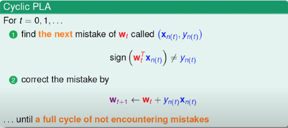

# Perceptron-Learning-Algorithm-PLA-
使用python3.8練習PLA
## 程式碼來源
from  [https://gist.github.com/yehjames](https://gist.github.com/yehjames/7dbe460f0d2aa882caa8fada45c3ec26)
## Perceptron Learning Algorithm(PLA)介紹
* 特性:

    這個演算法只有在資料是線性可分的形況下才能正確分類（演算法才會停止），是一種從錯誤中學習的方式

* 概念:

    神經元的數學模型:
    
    
    
    Input的數據會乘上一個權重weight，當w1*x1 + w2*x2 + w3*x3 +…. wn*xn >某一個定值，就會出發神經元發送信號出去。
    w1,w2,…wn,以及某一個定值都是這個神經元根據過往經驗學會的數字，也是資料科學家平常說在train這個model到底是在train什麼，就是找出w1,w2…wn以及某一個定值。
    接下來為了方便運算，將w0 = 某一個定值的負號, x0 則永遠都是1，再以二元的分類，將output大於0就判斷為+1，小於等於0就是-1。
    
* 原理:   

    

    當發現了一個錯誤，就會修正權重w，直到不再發現錯誤為止。
    
* 成果:       
    
    
